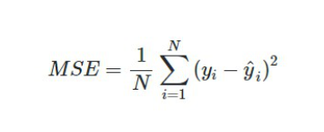
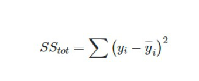

[视频链接](https://tianchi.aliyun.com/course/video?spm=5176.12586971.1001.24.62f9593aM8vRfg&liveId=41143)
### 1 赛题理解究竟是理解什么？

#### 1.1 理解问题背景，即数据的来源，实际用途背景资料。</br>

   **如：对二手车数据的预测。**

```
1. 分析问题是否可行的方法，有多少可行度，赛题做的价值大不大 
2. 理清一道赛题要从背后的赛题背景引发的赛题任务理解其中的任务逻辑，可能对于赛题有意义的外在数据有哪些
3. 并对于赛题数据有一个初步了解，知道现在和任务的相关数据有哪些，其中数据之间的关联逻辑是什么样的。

```

#### 1.2 理解问题类型，是回归分析问题，还是分类问题。</br>
  **如：对二手车价格预测就是典型的回归问题**

#### 1.3 理解问题类型的评价标准


评估指标即是我们对于一个模型效果的数值型量化。</br>
（有点类似与对于一个商品评价打分，而这是针对于模型效果和理想效果之间的一个打分）


### 2 常见的评估标准有哪些？

#### 2.1 分类问题常见的标准：

   对于二类分类器/分类算法，评价指标主要有accuracy， Precision，Recall，F-score，Pr曲线，ROC-AUC曲线。

   对于多类分类器/分类算法，评价指标主要有accuracy， 宏平均和微平均，F-score。
	
#### 2.2 对于回归预测类常见的评估指标如下:

1. 平均绝对误差（Mean Absolute Error，MAE）
2. 均方误差（Mean Squared Error，MSE）
3. 平均绝对百分误差（Mean Absolute Percentage Error，MAPE）
4. 均方根误差（Root Mean Squared Error）
5. R2（R-Square）


### 3 评估标准公式(主要 from sklearn import metrics)

3.1 平均绝对误差（Mean Absolute Error，MAE）:其能更好地反映预测值与真实值误差的实际情况，其计算公式如下：


3.2 均方误差 均方误差（Mean Squared Error，MSE）,均方误差,其计算公式为：


3.3 R2（R-Square）的公式为： 残差平方和：



3.4 总平均值:


### 4 赛题分析

1.此题为传统的数据挖掘问题，通过数据科学以及机器学习深度学习的办法来进行建模得到结果。此题是一个典型的回归问题。

2.主要应用xgb、lgb、catboost，以及pandas、numpy、matplotlib、seabon、sklearn、keras等等数据挖掘常用库或者框架来进行数据挖掘任务。

3.通过EDA来挖掘数据的联系和自我熟悉数据。

#### 4.1 读取数据

```
通过Pandas对于数据进行读取 (pandas是一个很友好的数据读取函数库)
Train_data = pd.read_csv('data/used_car_train_20200313.csv', sep=' ') 
TestA_data = pd.read_csv('data/used_car_testA_20200313.csv', sep=' ')


输出数据的大小信息
print('Train data shape:',Train_data.shape)
print('TestA data shape:',TestA_data.shape)


>>> Train data shape: (150000, 31)
     TestA data shape: (50000, 30)

```
#### 4.2 数据内容
```
通过.head() 简要浏览读取数据的形式
Train_data.head()
>>>
```
| SaleID | name | regDate | model    | brand | bodyType | fuelType | gearbox | power | kilometer | ...  | v_5 | v_6      | v_7      | v_8      | v_9      | v_10     | v_11      | v_12     | v_13      | v_14      |
| ------ | ---- | ------- | -------- | ----- | -------- | -------- | ------- | ----- | --------- | ---- | --- | -------- | -------- | -------- | -------- | -------- | --------- | -------- | --------- | --------- |
| 0      | 0    | 736     | 20040402 | 30.0  | 6        | 1.0      | 0.0     | 0.0   | 60        | 12.5 | ... | 0.235676 | 0.101988 | 0.129549 | 0.022816 | 0.097462 | -2.881803 | 2.804097 | -2.420821 | 0.795292  |
| 1      | 1    | 2262    | 20030301 | 40.0  | 1        | 2.0      | 0.0     | 0.0   | 0         | 15.0 | ... | 0.264777 | 0.121004 | 0.135731 | 0.026597 | 0.020582 | -4.900482 | 2.096338 | -1.030483 | -1.722674 |
| 2      | 2    | 14874   | 20040403 | 115.0 | 15       | 1.0      | 0.0     | 0.0   | 163       | 12.5 | ... | 0.251410 | 0.114912 | 0.165147 | 0.062173 | 0.027075 | -4.846749 | 1.803559 | 1.565330  | -0.832687 |
| 3      | 3    | 71865   | 19960908 | 109.0 | 10       | 0.0      | 0.0     | 1.0   | 193       | 15.0 | ... | 0.274293 | 0.110300 | 0.121964 | 0.033395 | 0.000000 | -4.509599 | 1.285940 | -0.501868 | -2.438353 |
| 4      | 4    | 111080  | 20120103 | 110.0 | 5        | 1.0      | 0.0     | 0.0   | 68        | 5.0  | ... | 0.228036 | 0.073205 | 0.091880 | 0.078819 | 0.121534 | -1.896240 | 0.910783 | 0.931110  | 2.834518  |

#### 4.3  分类评价指标

##### accuracy
```
import numpy as np
from sklearn.metrics import accuracy_score
y_pred = [0, 1, 0, 1]
y_true = [0, 1, 1, 1]
print('ACC:',accuracy_score(y_true, y_pred))
>>> ACC: 0.75

```

##### Precision,Recall,F1-score
```
from sklearn import metrics
y_pred = [0, 1, 0, 0]
y_true = [0, 1, 0, 1]
print('Precision',metrics.precision_score(y_true, y_pred))
print('Recall',metrics.recall_score(y_true, y_pred))
print('F1-score:',metrics.f1_score(y_true, y_pred))

>>> Precision 1.0
	Recall 0.5
	F1-score: 0.666666666667
```
#####  AUC
```
import numpy as np
from sklearn.metrics import roc_auc_score
y_true = np.array([0, 0, 1, 1])
y_scores = np.array([0.1, 0.4, 0.35, 0.8])
print('AUC socre:',roc_auc_score(y_true, y_scores))

>>> AUC socre: 0.75
```
#### 4.2 回归评价标准

#####  MSE,RMSE,MAE,MAPE
```
# coding=utf-8
import numpy as np
from sklearn import metrics

# MAPE需要自己实现
def mape(y_true, y_pred):
    return np.mean(np.abs((y_pred - y_true) / y_true))

y_true = np.array([1.0, 5.0, 4.0, 3.0, 2.0, 5.0, -3.0])
y_pred = np.array([1.0, 4.5, 3.8, 3.2, 3.0, 4.8, -2.2])

# MSE
print('MSE:',metrics.mean_squared_error(y_true, y_pred))
# RMSE
print('RMSE:',np.sqrt(metrics.mean_squared_error(y_true, y_pred)))
# MAE
print('MAE:',metrics.mean_absolute_error(y_true, y_pred))
# MAPE
print('MAPE:',mape(y_true, y_pred))

>>> MSE: 0.287142857143
	RMSE: 0.535857123815
	MAE: 0.414285714286
	MAPE: 0.14619047619
```
##### R2-score
```
from sklearn.metrics import r2_score
y_true = [3, -0.5, 2, 7]
y_pred = [2.5, 0.0, 2, 8]
print('R2-score:',r2_score(y_true, y_pred))

>>> R2-score: 0.948608137045
```

作为切入一道赛题的基础，赛题理解是极其重要的，对于赛题的理解甚至会影响后续的特征工程构建以及模型的选择，最主要是会影响后续发展工作的方向，比如挖掘特征的方向或者存在问题解决问题的方向，对了赛题背后的思想以及赛题业务逻辑的清晰，也很有利于花费更少时间构建更为有效的特征模型，赛题理解要达到的地步是什么呢，把一道赛题转化为一种宏观理解的解决思路。 以下将从多方面对于此进行说明：

1） 赛题理解究竟是理解什么： 理解赛题是不是把一道赛题的背景介绍读一遍就OK了呢？并不是的，理解赛题其实也是从直观上梳理问题，**分析问题是否可行的方法**，有多少可行度，赛题做的价值大不大，理清一道赛题要从背后的**赛题背景**引发的赛题任务理解其中的**任务逻辑**，可能对于赛题有意义的外在数据有哪些，并对于赛题数据有一个初步了解，知道现在和任务的相关数据有哪些，其中**数据之间的关联逻辑是什么样的**。 对于不同的问题，在处理方式上的差异是很大的。如果用简短的话来说，并且在比赛的角度或者做工程的角度，就是**该赛题符合的问题是什么问题**，**大概要去用哪些指标**，**哪些指标是否会做到线上线下的一致性**，是否有效的利于我们进一步的探索更高线上分数的线下验证方法，在业务上，你是否**对很多原始特征有很深刻的了解**，并且可以**通过EDA来寻求他们直接的关系，最后构造出满意的特征**。

2） 有了赛题理解后能做什么： 在对于赛题有了一定的了解后，分析清楚了问题的类型性质和对于数据理解的这一基础上，是不是赛题理解就做完了呢? 并不是的，就像摸清了敌情后，我们至少就要有一些相应的理解分析，比如这题的难点可能在哪里，关键点可能在哪里，哪些地方可以挖掘更好的特征，用什么样得线下验证方式更为稳定，出现了过拟合或者其他问题，估摸可以用什么方法去解决这些问题，哪些数据是可靠的，哪些数据是需要精密的处理的，哪部分数据应该是关键数据（背景的业务逻辑下，比如CTR的题，一个寻常顾客大体会有怎么样的购买行为逻辑规律，或者风电那种题，如果机组比较邻近，相关一些风速，转速特征是否会很近似）。这时是在一个宏观的大体下分析的，有助于摸清整个题的思路脉络，以及后续的分析方向。

3） 赛题理解的-**评价指标**： 为什么要把这部分单独拿出来呢，因为这部分会涉及后续模型预测中两个很重要的问题： 1． 本地模型的验证方式，很多情况下，线上验证是有一定的时间和次数限制的，所以在比赛中构建一个合理的本地的验证集和验证的评价指标是很关键的步骤，能有效的节省很多时间。 2． **不同的指标对于同样的预测结果是具有误差敏感的差异性的**，比如AUC，logloss, MAE，RSME，或者一些特定的评价函数。是会有很大可能会影响后续一些预测的侧重点。

4） 赛题背景中可能潜在隐藏的条件： 其实赛题中有些说明是很有利益-都可以在后续答辩中以及问题思考中所体现出来的，比如**高效性要求**，比如对于数据异常的识别处理，比如**工序流程的差异性**，比如**模型运行的时间**，比**模型的鲁棒性**，有些的意识是可以贯穿问题思考，特征，模型以及后续处理的，也有些会对于特征构建或者选择模型上有很大益处，反过来如果在模型预测效果不好，其实有时也要反过来思考，是不是赛题背景有没有哪方面理解不清晰或者什么其中的问题没考虑到。