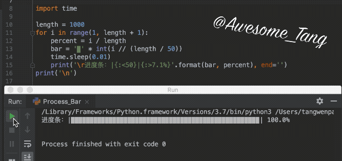

Python格式化输出—format

作者 ：AwesomeTang
 [https://www.jianshu.com/p/98971acbd426][原文链接地址]

**format 或者 %**

提到Python中的格式化输出方法，一般来说有以下两种方式：

```markdown
print('hello %s' % 'world')
# hello world
print('hello {}'.format('world'))
# hello world
```

到底哪种好呢，反正对我来说，用了.format()之后就再也不想用%了。

1. format()不用理会数据类型，%s，%f等等我记不完；
2. format()功能更丰富，填充方式，对齐方式都很灵活，让你的打印效果更美观；
3. format()是官方推荐的，%指不定就在未来版本中给废弃掉了。

**基本用法**
```markdown
print('{} {}'.format('hello', 'world'))  # 最基本的
print('{0} {1}'.format('hello', 'world'))  # 通过位置参数
print('{0} {1} {0}'.format('hello', 'world'))  # 单个参数多次输出

"""
输出结果
hello world
hello world
hello world hello
"""
```

**关键词定位**

```
# 通过关键词参数
print('我的名字是{name},我今年{age}岁了。'.format(name='小明', age='12'))

# 与位置参数一样，单个参数也能多次输出
print('{name}说："我的名字是{name},我今年{age}岁了。"'.format(name='小明', age='12'))

"""输出结果
我的名字是小明,我今年12岁了。
小明说："我的名字是小明,我今年12岁了。"
"""
```

**可变参数**

既然format()是一个方法，那是不是也接受*args和**kwargs形式的传参呢，答案是肯定的。

```
# 传入list
data = ['hello', 'world']
print('{0} {1}'.format(*data))
```

```
# 传入dict
data = {'name': '小明', 'age': 12}
print('我的名字是{name},我今年{age}岁了。'.format(**data))
```

```
# 混用
data_1 = ['hello', 'world']
data_2 = {'name': '小明', 'age': 12}
print('{0} {1} 我的名字是{name},我今年{age}岁了,{0}!'.format(*data_1, **data_2))


"""输出结果
hello world
我的名字是小明,我今年12岁了。
hello world 我的名字是小明,我今年12岁了,hello!
"""
```

**固定宽度**

format()可以指定输出宽度为多少，当字符串长度少于设定值的时候，默认用空格填充：

```markdown
data = [{'name': 'Mary', 'college': 'Tsinghua University'},
        {'name': 'Micheal', 'college': 'Harvard University'},
        {'name': 'James', 'college': 'Massachusetts Institute of Technology'}]
# 固定宽度输出
for item in data:
    print('{:10}{:40}'.format(item['name'], item['college']))

"""输出结果
Mary      Tsinghua University                     
Micheal   Harvard University                      
James     Massachusetts Institute of Technology   
"""
```

当然除了空格，我们也可以选择其他字符来填充，譬如我想打印一条分割线,便可以选择通过-来填充：
```markdown
data = [{'name': 'Mary', 'college': 'Tsinghua University'},
        {'name': 'Micheal', 'college': 'Harvard University'},
        {'name': 'James', 'college': 'Massachusetts Institute of Technology'}]

# 固定宽度输出
for item in data:
    # 每输出一条记录之前打印一条分割线
    # 选择用其他字符来填充时需要指定对齐方式
    print('{:-^60}'.format('我是分割线'))
    print('{:10}{:40}'.format(item['name'], item['college']))

"""输出结果
---------------------------我是分割线----------------------------
Mary      Tsinghua University                     
---------------------------我是分割线----------------------------
Micheal   Harvard University                      
---------------------------我是分割线----------------------------
James     Massachusetts Institute of Technology   
"""
```

**对齐方式**

format()支持左对齐，右对齐，居中，分别对应<，>，^，具体怎么使用我们看实例：
```markdown
data = [{'name': 'Mary', 'college': 'Tsinghua University'},
        {'name': 'Micheal', 'college': 'Harvard University'},
        {'name': 'James', 'college': 'Massachusetts Institute of Technology'}]


print('{:-^50}'.format('居中'))
for item in data:
    print('{:^10}{:^40}'.format(item['name'], item['college']))

print('{:-^50}'.format('左对齐'))
for item in data:
    print('{:<10}{:<40}'.format(item['name'], item['college']))

print('{:-^50}'.format('右对齐'))
for item in data:
    print('{:>10}{:>40}'.format(item['name'], item['college']))

"""输出结果
------------------------居中------------------------
   Mary             Tsinghua University           
 Micheal             Harvard University           
  James    Massachusetts Institute of Technology  
-----------------------左对齐------------------------
Mary      Tsinghua University                     
Micheal   Harvard University                      
James     Massachusetts Institute of Technology   
-----------------------右对齐------------------------
      Mary                     Tsinghua University
   Micheal                      Harvard University
     James   Massachusetts Institute of Technology
"""
```

**数字格式化**

常用的示例如下：
```markdown
# 取小数点后两位
num = 3.1415926
print('小数点后两位：{:.2f}'.format(num))

# 带+/-输出
num = -3.1415926
print('带正/负符号：{:+.2f}'.format(num))

# 转为百分比
num = 0.34534
print('百分比：{:.2%}'.format(num))

# 科学计数法
num = 12305800000
print('科学计数法：{:.2e}'.format(num))

# ,分隔
num = 12305800000
print('","分隔：{:,}'.format(num))

# 转为二进制
num = 15
print('二进制：{:b}'.format(num))

# 十六进制
num = 15
print('十六进制：{:x}'.format(num))

# 八进制
num = 15
print('八进制：{:o}'.format(num))

"""输出结果
小数点后两位：3.14
带正/负符号：-3.14
百分比：34.53%
科学计数法：1.23e+10
","分隔：12,305,800,000
二进制：1111
十六进制：f
八进制：17
"""
```

**输出花括号**

当然，如果我们想输出的{}的时候怎么办呢？
```markdown
# 输出花括号
print('我是{{{}}}'.format('Awesome_Tang'))

"""输出结果
我是{Awesome_Tang}
"""

```

**花式玩法**

其实结合以上这些特性，我们可以来点好玩点，譬如说自己写一个进度条：
```markdown
import time

length = 1000
for i in range(1, length + 1):
    percent = i / length
    bar = '▉' * int(i // (length / 50))
    time.sleep(0.01)
    print('\r进度条：|{:<50}|{:>7.1%}'.format(bar, percent), end='')
print('\n')
```




### 补充一个功能

使用f和{}的组合，轻松操作格式化字符

```markdown
age = int(input("Please input your age:"))
name = input("Please input your name:")
print(f"Ok,your name is {age}, and your age is {name}." )
```


[]: https://www.jianshu.com/p/98971acbd426