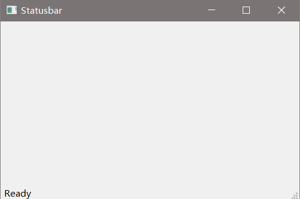

PyQt5菜单栏&状态栏

这个章节，我们会创建状态栏、菜单和工具栏。

* 菜单是一组位于菜单栏的命令。
* 工具栏是应用的一些常用工具按钮。
* 状态栏显示一些状态信息，通常在应用的底部。

#### 状态栏

    
    #!/usr/bin/python3
    # -*- coding: utf-8 -*-

    """
    ZetCode PyQt5 tutorial 
    
    This program creates a statusbar.
    
    Author: Jan Bodnar
    Website: zetcode.com 
    Last edited: August 2017
    """
    
    import sys
    from PyQt5.QtWidgets import QMainWindow, QApplication
    
    
    class Example(QMainWindow):
        
        def __init__(self):
            super().__init__()
            
            self.initUI()
            
            
        def initUI(self):               
            
            self.statusBar().showMessage('Ready')
            
            self.setGeometry(300, 300, 250, 150)
            self.setWindowTitle('Statusbar')    
            self.show()
    
    
    if __name__ == '__main__':
        
        app = QApplication(sys.argv)
        ex = Example()
        sys.exit(app.exec_())

状态栏是由QMainWindow创建的。

    self.statusBar().showMessage('Ready')
    
调用QtGui.QMainWindow类的statusBar()方法，创建状态栏。

第一次调用创建一个状态栏，返回一个状态栏对象。

showMessage()方法在状态栏上显示一条信息。

#### 菜单栏

菜单栏是非常常用的，是一组命令的集合。

    #!/usr/bin/python3
    # -*- coding: utf-8 -*-
    
    """
    ZetCode PyQt5 tutorial 
    
    This program creates a menubar. The
    menubar has one menu with an exit action.
    
    Author: Jan Bodnar
    Website: zetcode.com 
    Last edited: January 2017
    """
    
    import sys
    from PyQt5.QtWidgets import QMainWindow, QAction, qApp, QApplication
    from PyQt5.QtGui import QIcon
    
    
    class Example(QMainWindow):
        
        def __init__(self):
            super().__init__()
            
            self.initUI()
            
            
        def initUI(self):               
            
            exitAct = QAction(QIcon('exit.png'), '&Exit', self)        
            exitAct.setShortcut('Ctrl+Q')
            exitAct.setStatusTip('Exit application')
            exitAct.triggered.connect(qApp.quit)
    
            self.statusBar()
    
            menubar = self.menuBar()
            fileMenu = menubar.addMenu('&File')
            fileMenu.addAction(exitAct)
            
            self.setGeometry(300, 300, 300, 200)
            self.setWindowTitle('Simple menu')    
            self.show()
            
            
    if __name__ == '__main__':
        
        app = QApplication(sys.argv)
        ex = Example()
        sys.exit(app.exec_())
        
我们创建了只有一个命令的菜单栏，这个命令就是终止应用。

同时也创建了一个状态栏,在状态栏显示 'Exit application'。而且还能使用快捷键Ctrl+Q退出应用。

    exitAct = QAction(QIcon('exit.png'), '&Exit', self)        
    exitAct.setShortcut('Ctrl+Q')
    exitAct.setStatusTip('Exit application')
    
QAction是菜单栏、工具栏或者快捷键的动作的组合。

前面两行，我们创建了一个图标、一个exit的标签和一个快捷键组合，都执行了一个动作。

第三行，创建了一个状态栏，当鼠标悬停在菜单栏的时候，能显示当前状态。

    exitAct.triggered.connect(qApp.quit)
    
当执行这个指定的动作时，就触发了一个事件。

这个事件跟QApplication的quit()行为相关联，所以这个动作就能终止这个应用。

    menubar = self.menuBar()
    fileMenu = menubar.addMenu('&File')
    fileMenu.addAction(exitAct)

menuBar()创建菜单栏。这里创建了一个菜单栏，并在上面添加了一个file菜单，并关联了点击退出应用的事件。

### 子菜单

子菜单是嵌套在菜单里面的二级或者三级等的菜单。

    #!/usr/bin/python3
    # -*- coding: utf-8 -*-
    
    """
    ZetCode PyQt5 tutorial 
    
    This program creates a submenu.
    
    Author: Jan Bodnar
    Website: zetcode.com 
    Last edited: August 2017
    """
    
    import sys
    from PyQt5.QtWidgets import QMainWindow, QAction, QMenu, QApplication
    
    class Example(QMainWindow):
        
        def __init__(self):
            super().__init__()
            
            self.initUI()
            
            
        def initUI(self):         
            
            menubar = self.menuBar()
            fileMenu = menubar.addMenu('File')
            
            impMenu = QMenu('Import', self)
            impAct = QAction('Import mail', self) 
            impMenu.addAction(impAct)
            
            newAct = QAction('New', self)        
            
            fileMenu.addAction(newAct)
            fileMenu.addMenu(impMenu)
            
            self.setGeometry(300, 300, 300, 200)
            self.setWindowTitle('Submenu')    
            self.show()
            
            
    if __name__ == '__main__':
        
        app = QApplication(sys.argv)
        ex = Example()
        sys.exit(app.exec_())
        
这个例子里，有两个子菜单，一个在file菜单下面，一个在file的import下面。

    impMenu = QMenu('Import', self)
    
使用QMenu创建一个新菜单。

    impAct = QAction('Import mail', self) 
    impMenu.addAction(impAct)
    
使用addAction添加一个动作。

### 勾选菜单

下面是一个能勾选菜单的例子

    #!/usr/bin/python3
    # -*- coding: utf-8 -*-
    
    """
    ZetCode PyQt5 tutorial 
    
    This program creates a checkable menu.
    
    Author: Jan Bodnar
    Website: zetcode.com 
    Last edited: August 2017
    """
    
    import sys
    from PyQt5.QtWidgets import QMainWindow, QAction, QApplication
    
    class Example(QMainWindow):
        
        def __init__(self):
            super().__init__()
            
            self.initUI()
            
            
        def initUI(self):         
            
            self.statusbar = self.statusBar()
            self.statusbar.showMessage('Ready')
            
            menubar = self.menuBar()
            viewMenu = menubar.addMenu('View')
            
            viewStatAct = QAction('View statusbar', self, checkable=True)
            viewStatAct.setStatusTip('View statusbar')
            viewStatAct.setChecked(True)
            viewStatAct.triggered.connect(self.toggleMenu)
            
            viewMenu.addAction(viewStatAct)
            
            self.setGeometry(300, 300, 300, 200)
            self.setWindowTitle('Check menu')    
            self.show()
            
        def toggleMenu(self, state):
            
            if state:
                self.statusbar.show()
            else:
                self.statusbar.hide()
           
            
    if __name__ == '__main__':
        
        app = QApplication(sys.argv)
        ex = Example()
        sys.exit(app.exec_())
        
本例创建了一个行为菜单。这个行为／动作能切换状态栏显示或者隐藏。

    viewStatAct = QAction('View statusbar', self, checkable=True)
    
用checkable选项创建一个能选中的菜单。

    viewStatAct.setChecked(True)
    
默认设置为选中状态。

    def toggleMenu(self, state):
        
        if state:
            self.statusbar.show()
        else:
            self.statusbar.hide()
            
依据选中状态切换状态栏的显示与否。 